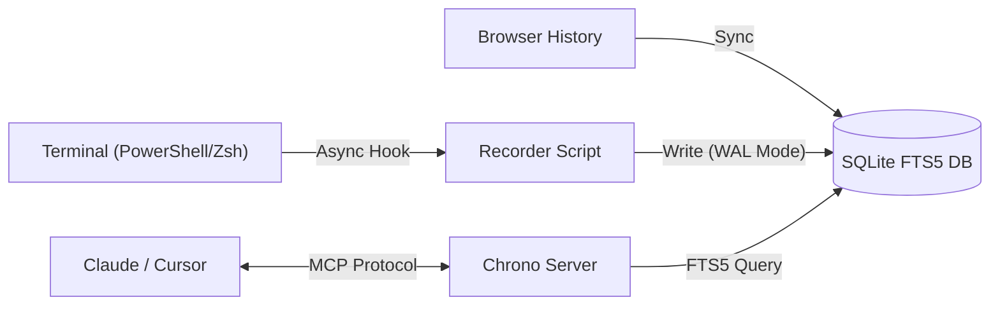

<div align="center">

# ⏳ Chrono-MCP

### The "Second Brain" for Your AI Coding Assistant
**Infinite Context • Local Privacy • Instant Recall**

[](https://opensource.org/licenses/MIT)
[](https://www.typescriptlang.org/)
[](https://modelcontextprotocol.io/)
[]()

[Features](#-features) • [Quick Start](#-quick-start) • [How it Works](#-how-it-works) • [Roadmap](#-roadmap)

---


</div>

## 🚀 Why Chrono?

Your AI assistant (Claude, Cursor, Windsurf) is brilliant, but it has **amnesia**. It doesn't know:
* *"What was that ffmpeg command I ran 5 minutes ago?"*
* *"Which StackOverflow thread was I reading before I fixed this bug?"*
* *"What error message did I just get in the terminal?"*

**Chrono** bridges this gap. It is a local-first MCP server that silently indexes your **Terminal** and **Browser** history into a high-performance SQLite FTS5 search engine, giving your AI **instant recall** of your workflow.

## ✨ Features

- **🔍 Smart Full-Text Search (FTS5):** Built on SQLite's robust FTS5 engine using BM25 ranking. Forget `grep`—search naturally for keywords like *"git commit error"* or *"json parser"* to find commands you ran weeks ago.
- **🛡️ 100% Local & Private:** Your data is sacred. Everything is stored locally in `~/.chrono-mcp`. No cloud uploads, ever.
- **🐚 Zero-Latency Hooks:** Optimized asynchronous hooks for **PowerShell** (Windows) and **Zsh** (macOS/Linux). It records your history silently in the background without slowing down your terminal.
- **🔌 One-Click Setup:** Comes with an automated installer (`npm run install:cli`) that configures your Shell profile and Claude/Cursor config files automatically.

## ⚡ Quick Start

### Prerequisites
* Node.js (v18+)
* Claude Desktop or Cursor

The Magic Installer (Recommended)

We provide an automated script that detects your OS, sets up the database, configures shell hooks, and connects to Claude.

```bash
# 1. Clone the repo
git clone [https://github.com/your-username/chrono-mcp.git](https://github.com/your-username/chrono-mcp.git)
cd chrono-mcp

# 2. Install dependencies & Build
npm install
npm run build

# 3. Run the Auto-Installer 🪄
npm run install:cli
```

After installation: Restart your Terminal and Claude/Cursor to apply changes.

Manual Setup

<details> <summary>Click to expand manual instructions</summary>

1.Build Project:

```bash
npm run build
```

2.Initialize Database:

```bash
node build/db.js
```

3.Add to Claude/Cursor Config: Edit %APPDATA%\Claude\claude_desktop_config.json (Windows) or ~/Library/Application Support/Claude/claude_desktop_config.json (Mac):

```JSON
{
  "mcpServers": {
    "chrono": {
      "command": "node",
      "args": ["/ABSOLUTE/PATH/TO/chrono-mcp/build/index.js"]
    }
  }
}
```

4.Add Shell Hook: Check bin/install.js for the hook script logic and add it manually to your .zshrc or PowerShell $PROFILE.

</details>

💡 Usage Examples

Once connected, open Cursor (Agent Mode) or Claude Desktop and try these prompts:

"Check my terminal history, what was the last git command I ran?"
"I was looking at a documentation page about 'React Server Components' yesterday. Can you find the URL?"
"Based on my recent terminal errors, what seems to be the problem?"

## 🛠️ Architecture

Chrono uses a sophisticated local architecture to ensure performance and privacy:



SQLite WAL Mode: Allows concurrent writing (from terminal) and reading (from AI) without locking.

FTS5 Engine: Provides advanced full-text search capabilities (Prefix matching, ranking) far superior to simple substring matching.

🗺️ Roadmap

- [x] Windows PowerShell Support
- [x] macOS/Linux Zsh Support
- [x] SQLite FTS5 Full-Text Search (Current v1.1)
- [ ] Semantic Vector Search: Integrate transformers.js to understand intent (e.g., searching "undo" finds git reset).
- [ ] Web Dashboard: A local timeline view of your development journey.

🤝 Contributing

We love contributors! If you want to add Bash support or improve the search algorithm:

1.Fork the repo.
2.Create a branch (git checkout -b feature/amazing-feature).
3.Commit your changes.
4.Push to the branch.
5.Open a Pull Request.

📜 License
Distributed under the MIT License. See LICENSE for more information.

<div align="center"> <sub>Built with ❤️ by <a href="https://www.google.com/search?q=https://github.com/bingdongni">bingdongni</a> using the Model Context Protocol.</sub> </div>
